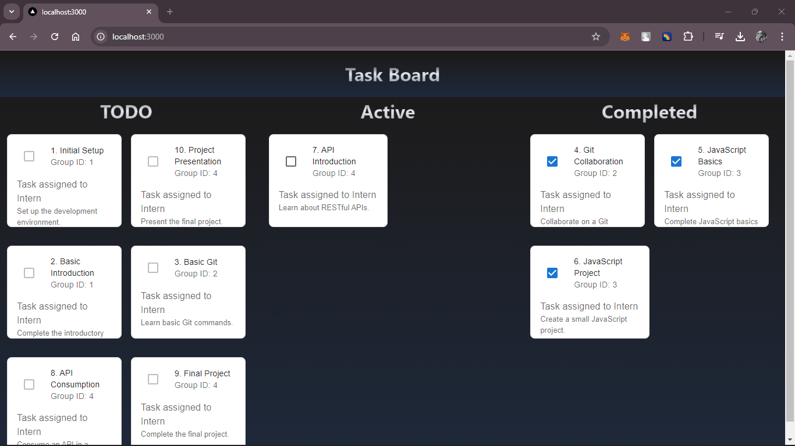
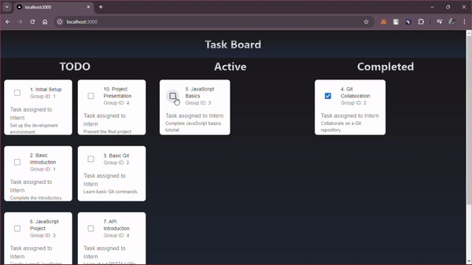

### Demo

This is the screenshot of the UI.

The above GIF shows the main features of the application.

The API endpoints can be found in api folder under pages.I have used Redis as database in order to store the data of ToDo List.